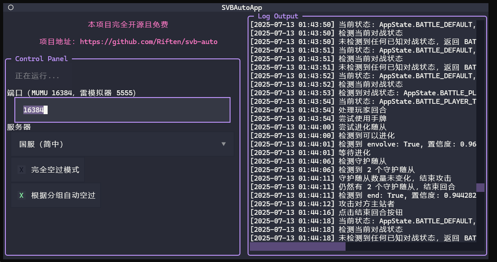

# SVB Auto

本项目仅作机器视觉相关学习与交流使用，禁止用于商业目的，禁止用于破坏游戏环境。

本项目基于 MIT 协议开源，欢迎进行二次开发与扩展，欢迎提交 pull request。

## 基础功能

影之诗自动对战，不支持智能战斗，会自动进行卡片使用（不区分卡片类型）、随从进化与超进化（如果场上有的话）、消灭守护随从、攻击对方（如果可以的话）、结束回合。

本项目只支持安卓模拟器环境下的游戏运行，通过 adb 调试实现游戏控制。

目前不支持自动领取每日免费卡包。

## 简易安装与使用

从 RELEASE 界面获取可执行程序，运行 `svb_auto_app.exe`

对于 MUMU 模拟器，需要关闭 `设置 -> 其他 -> 应用运行 -> 后台挂机时保活运行`。参考 issue [#1](https://github.com/Riften/svb-auto/issues/1#issuecomment-3027869140) [#1](https://github.com/Riften/svb-auto/issues/1#issuecomment-3028236417)

界面上的端口设置，MUMU 模拟器默认端口为 16384，雷电模拟器为 5555。

点击启动即可运行，正常运行界面如下所示：



## 打包与发布（面向开发者）

uiautomator with pyinstaller: [issue](https://github.com/openatx/uiautomator2/issues/1060)

```bash
pyinstaller --noconfirm --onedir --console --add-data "<path to uiautomator2>\uiautomator2\assets;uiautomator2/assets/"  "python_package\svb_auto\ui\svb_auto_app.py"
```

`<path to uiautomator2>` 可以通过 `pip show uiautomator2` 得到。

然后讲 `imgs_chs_1920_1080` 文件夹复制到打包路径下。

## 命令行安装与使用 （面向开发者）

<details>

<summary>展开</summary>

### 安装

```bash
cd 项目根目录
pip install -r requirements.txt
pip install -e .
```

如果安装遇到网络问题，可以尝试使用[清华镜像源](https://mirrors.tuna.tsinghua.edu.cn/help/pypi/)安装

```bash
pip install -i https://mirrors.tuna.tsinghua.edu.cn/pypi/web/simple -r requirements.txt
```

### 使用

启动模拟器。

对于 MUMU 模拟器，需要关闭 `设置 -> 其他 -> 应用运行 -> 后台挂机时保活运行`。参考 issue [#1](https://github.com/Riften/svb-auto/issues/1#issuecomment-3027869140) [#1](https://github.com/Riften/svb-auto/issues/1#issuecomment-3028236417)

对于雷模拟器，其默认 adb 端口为 5555，运行下面指令时需要添加参数 `--port 5555`

```bash
cd 项目根目录
python -m svb_auto.main

# 如果不希望在回合中操作，而是希望空过
python -m svb_auto.main --skip_mode

# 如果希望运行国际服（繁体中文）
python -m svb_auto.main --global_server

# 查看所有命令行参数
python -m svb_auto.main --help
```

如果一切顺利，将会检测模拟器画面上的 app 图标，启动应用。如果应用已经启动，则会直接根据应用所处状态开始对战。

</details>

## KNOWN ISSUE

1. 法术牌无法选择效果，目前避免卡死的方案是每使用一张牌都点一下对方主站者
2. 只支持 1920 x 1080 分辨率，且模拟器初始就需要处于横屏状态
3. 无法正确检测超进化的守护随从。

## TODO

- [ ] 每日广场对战任务
- [x] 自动过墙。通过简单的模板匹配+颜色识别实现。
- [ ] 项目打包，做成 exe 方便使用
- [ ] EXITED 状态检测过于粗糙

## 重要更新

- 2025.06.29, V1.0.0 初始版本
- 2025.07.04, V1.1.0 简单的过墙，但误报率过高
- 2025.07.12, V1.2.1 简单的 UI 界面和 exe 打包。